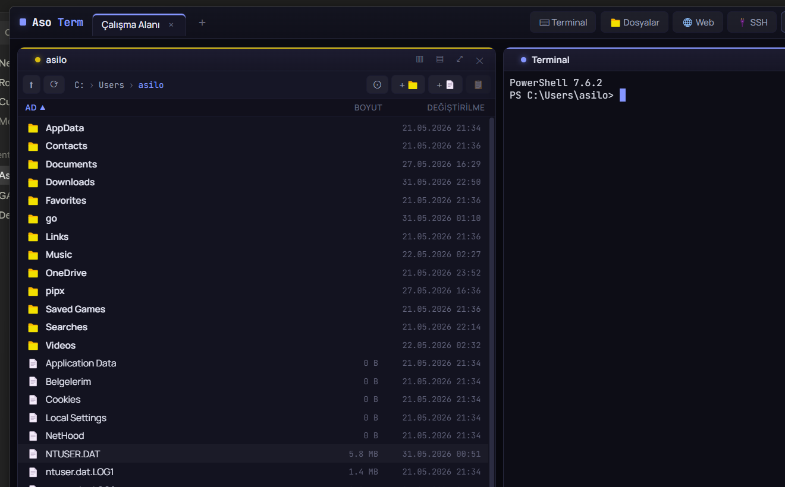

# AsoTerm

Wave Terminal tarzı, **blok tabanlı sürükle-bırak döşeme** düzenine sahip bir terminal
ve dosya çalışma alanı. Her blok bir **terminal** (yerel veya **SSH**), **kod editörü**
(Monaco), **dosya önizleme**, **dosya gezgini** veya **web tarayıcı** olabilir.

**Öne çıkanlar:** sürükle-böl döşeme · sekmeler arası blok kalıcılığı (cross-fade) ·
düzen + ayar kalıcılığı · komut paleti · özelleştirilebilir tema · frameless özel
pencere çubuğu · NSIS kurulum paketi.



> **İndir:** [Releases](https://github.com/asilozkryl/AsoTerm/releases) sayfasından
> `AsoTerm-<sürüm>-setup.exe` (Windows x64).

## Mimari

Wave ile aynı desen: **Electron kabuk + Go HTTP/WebSocket sidecar sunucusu + React renderer**.

```
AsoTerm/
  cmd/asoterm-server/      Go sidecar giriş noktası (HTTP+WS, port+token stdout'a)
  internal/
    terminal/              ConPTY/PTY çoklu terminal (go-pty), Sink ile WS'e yayın
    fsmanager/             dosya listeleme/işlem + metin oku-yaz
    api/                   HTTP mux (token+CORS) + WebSocket hub (terminal çoğullama)
  desktop/                 Electron + React (electron-vite)
    src/main/              sidecar spawn + port/token + pencere
    src/preload/           güvenli köprü (contextBridge)
    src/renderer/src/
      api/                 REST + terminal WS istemcileri
      blocks/              Terminal / Editor (Monaco) / Preview / Files blokları
      tiling/              react-mosaic döşeme çalışma alanı
      store.ts             zustand: sekmeler + mosaic düzeni + bloklar
    resources/             derlenen asoterm-server ikilisi (npm script'i derler)
```

## Gereksinimler

- **Go** (1.25+) — PATH'te (`C:\Program Files\Go\bin`)
- **Node.js** + npm
- Windows'ta **WebView2** (Electron için Chromium dahili gelir)

## Geliştirme

```bash
cd desktop
npm install
npm run dev      # Go sunucusunu derler + Electron'u hot-reload ile başlatır
```

> İlk kurulumda Electron ikilisi inmezse: `node node_modules/electron/install.js`
> (OneDrive/Defender extract'i kesebilir; gerekirse önbellekteki zip `tar -xf` ile
> `node_modules/electron/dist` içine elle çıkarılıp `path.txt` = `electron.exe` yazılır).

## Üretim derlemesi & kurulum paketi

```bash
cd desktop
npm run build    # Go ikilisi (GUI subsystem) + electron-vite build -> out/
npm run dist     # + electron-builder -> dist-installer/AsoTerm-<ver>-setup.exe (NSIS)
```

## Bloklar & kullanım

- **Üst çubuk:** sekmeler (`+` yeni sekme), **Blok ekle** (Terminal / Dosyalar) ve
  **Komut paleti** (`Ctrl+Shift+P`).
- **Döşeme:** blok başlığını sürükleyerek yeniden düzenle; köşeden boyutlandır.
  Her blok başlığında: **▥ yana böl**, **▤ aşağı böl** (yeni terminal), **⤢ büyüt**,
  **✕ kapat**.
- **Düzen kalıcılığı:** sekmeler ve blok düzeni `%APPDATA%/asoterm/workspace.json`
  dosyasına kaydedilir, açılışta geri yüklenir (terminaller yeni oturum olarak açılır).
- **Kısayollar:** `Ctrl+Shift+T` terminal · `Ctrl+Shift+E` gezgin · `Ctrl+Shift+N`
  sekme · `Ctrl+Shift+P` komut paleti.
- **Dosyalar bloğu:** çift tık ile klasöre gir veya dosyayı uygun blokta aç
  (kod → Monaco editör, resim/pdf/markdown/csv/video → önizleme). Araç çubuğundan
  yeni klasör/dosya, yeniden adlandır, sil.
- **Editör bloğu:** Monaco; `Ctrl+S` ile kaydeder.
- **Önizleme bloğu:** resim, video, ses, PDF, markdown, CSV, düz metin.
- **Web tarayıcı bloğu:** adres çubuğu, ileri/geri/yenile, oturum kalıcılığı (`<webview>`).
- **SSH terminali:** `🔌 SSH` ile uzak host'a bağlan (parola veya özel anahtar); kayıtlı
  profiller (parolasız). Üst çubuk `⚙` veya `Ctrl+,` ile **ayarlar** (tema/font/shell/web).

## Notlar

- Go sidecar Windows'ta **GUI subsystem** (`-H windowsgui`) derlenir ki ayrı bir
  konsol penceresi açılmasın; stdin/stdout Electron'ın pipe'ları üzerinden çalışır.
- Sunucu yalnız `127.0.0.1`'e bağlanır ve her isteği rastgele bir **token** ile korur.
- SSH parolaları **asla diske yazılmaz**; v1'de host anahtarı doğrulanmaz.

## Lisans

[GPL-3.0](LICENSE) © asilozkryl
